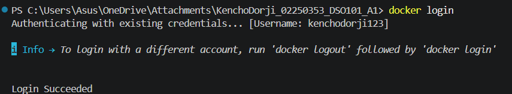
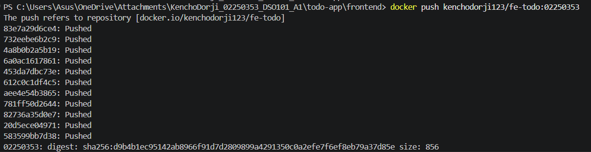
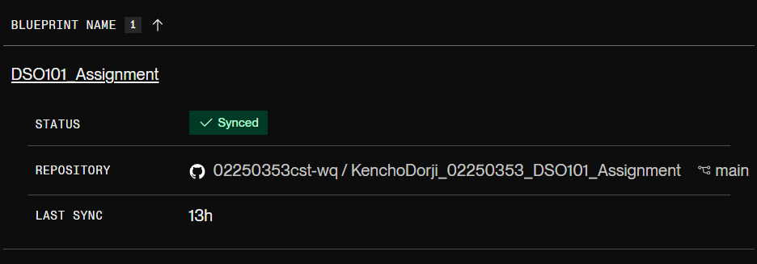

# DSO101 Assignment A1 & A2
## Assignment Repository Link
[Open
Repository](https://github.com/02250353cst-wq/KenchoDorji_02250353_DSO101_A1)

# Taskly — To-Do App
### DSO101 Assignment 1 | CI/CD with Docker & Render

---

## Project Structure

```
todo-app/
├── backend/
│   ├── server.js          # Express API (CRUD)
│   ├── package.json
│   ├── Dockerfile
│   └── .env.example       # Copy to .env and fill in values
├── frontend/
│   ├── index.html         # App UI
│   ├── style.css
│   ├── app.js             # API calls & rendering
│   ├── nginx.conf         # Nginx config for serving
│   ├── Dockerfile
│   └── .env.example
├── render.yaml            # Part B: Blueprint for Render
├── .gitignore
└── README.md
```

---

##  Tech Stack

| Layer    | Technology              |
|----------|-------------------------|
| Frontend | HTML, CSS, JavaScript   |
| Backend  | Node.js + Express       |
| Database | PostgreSQL              |
| Deploy   | Docker + Render.com     |

---

##  Step 0 — Run Locally

### Prerequisites
- [Node.js 18+](https://nodejs.org)
- [PostgreSQL](https://www.postgresql.org/download/) running locally
- [Docker Desktop](https://www.docker.com/products/docker-desktop/)

### 1. Clone the repo
```bash
git clone https://github.com/YOUR_USERNAME/YOUR_REPO_NAME.git
cd todo-app
```

### 2. Set up the Backend
```bash
cd backend
npm install
```

Copy the example env file and fill in your local PostgreSQL credentials:
```bash
cp .env.example .env
```

Edit `.env`:
```env
DB_HOST=dpg-d7tmtf9o3t8c739m6c80-a
DB_USER=postgres
DB_PASSWORD=fUWQB7cIk9ILagKc1fpqNkKwiyGhw19AP
DB_NAME=tododb
DB_PORT=5432
PORT=5000
NODE_ENV=development
FRONTEND_URL=http://localhost:3000
```

Create the database in PostgreSQL:
```bash
psql -U postgres -c "CREATE DATABASE tododb;"
```

Start the backend:
```bash
npm start


Test the API:
```bash
curl http://localhost:5000/health
# {"status":"ok"}
```

### 3. Set up the Frontend
The frontend is plain HTML/JS — just open in browser:
```bash
cd ../frontend
# Open index.html in your browser directly
# OR use VS Code Live Server extension
```

> The frontend reads `API_URL` from `window._env_.API_URL`. Locally it falls back to `http://localhost:5000` automatically.

---

## Part A — Build & Push Docker Images to Docker Hub

### 1. Create a Docker Hub account
Go to https://hub.docker.com and sign up. Note your Docker Hub username.

### 2. Login to Docker Hub
```bash
docker login


### 3. Build & Push Backend Image
> Replace `yourdockerhub` with your Docker Hub username and `YOURSTUDENTID` with your actual student ID.

```bash
cd backend

# Build image
docker build -t yourdockerhub/be-todo:YOURSTUDENTID .
<IMAGE href='/built_be.png'>

# Push to Docker Hub
docker push yourdockerhub/be-todo:YOURSTUDENTID.


### 4. Build & Push Frontend Image
```bash
cd ../frontend

# Build image
docker build -t yourdockerhub/fe-todo:YOURSTUDENTID .

# Push to Docker Hub
docker push yourdockerhub/fe-todo:YOURSTUDENTID

### 5. Deploy on Render.com (Part A — Manual Docker Image)

#### Database
1. Go to https://render.com → **New → PostgreSQL**
2. Name: `todo-db`
3. After creation, copy the **Internal Database URL** details (host, user, password, database name)

#### Backend Service
1. **New → Web Service**
2. Select **"Deploy an existing image from a registry"**
3. Image URL: `docker.io/kenchodorji123/be-todo:02250353`
4. Under **Environment Variables**, add:

| Key           | Value                               |
|---------------|-------------------------------------|
| `DB_HOST`     | (dpg-d7tmtf9o3t8c739m6c80-a)        |
| `DB_USER`     | (todo_db_57d9_user)                 |
| `DB_PASSWORD` | (fUWQB7cIk9ILagKc1fpqNkKwiyGhw19AP) |
| `DB_NAME`     | `tododb`                            |
| `DB_PORT`     | `5432`                              |
| `PORT`        | `5000`                              |
| `NODE_ENV`    | `production`                        |

5. Click **Create Web Service**
6. Copy the deployed URL `https://be-todo-02250353-1.onrender.com`

#### Frontend Service
1. **New → Web Service**
2. Select **"Deploy an existing image from a registry"**
3. Image URL: `docker.io/kenchodorji123/fe-todo:02250353`
4. Environment Variables:

| Key       | Value                             |
|-----------|-----------------------------------|
| `PORT` | `80`    |

5. Click **Create Web Service**


---

##  Part B — Automated Build & Deploy from GitHub

This removes manual Docker Hub steps — Render **automatically builds and deploys** on every `git push`.

### 1. Push your code to GitHub
```bash
git init
git add .
git commit -m "Initial commit - todo app"
git branch -M main
git remote add origin https://github.com/YOUR_USERNAME/YOUR_REPO.git
git push -u origin main
```

>  Make sure `.env` files are in `.gitignore` and NOT committed!

### 2. Connect GitHub to Render via Blueprint

1. Go to https://render.com → **New → Blueprint**
2. Connect your GitHub account
3. Select your repository

4. Render will detect the `render.yaml` file automatically
5. Click **Apply** — Render creates all services and the database

### 3. Set secret environment variables on Render
After the Blueprint deploys, go to each service's **Environment** tab and set the sensitive DB variables (Render auto-links them via `fromDatabase` in `render.yaml`).

### 4. Test Auto-Deploy
Make any change to your code and push:
```bash
git add .
git commit -m "Test auto-deploy"
git push
```
Render automatically rebuild and redeploy both services! 

##### -------------------------------------------------------------------------------------------- #####

# # Todo App CI/CD Pipeline with Jenkins-DSO101 Assignment 2

## Project Overview

This project implements a complete **Continuous Integration and Continuous Deployment (CI/CD)** pipeline for a full-stack Todo application using Jenkins. The pipeline automates the process of code checkout, dependency installation, testing, Docker image building, and pushing to Docker Hub.

##  Technologies Used

| Technology | Purpose |
|------------|---------|
| **Jenkins** | CI/CD automation server |
| **GitHub** | Source code hosting |
| **Node.js** | Backend JavaScript runtime |
| **Express.js** | Backend web framework |
| **Jest & Supertest** | Unit testing framework |
| **Docker** | Containerization |
| **Nginx** | Frontend web server |
| **Docker Hub** | Container registry |

## Project Structure
todo-app/
├── backend/                    
│ ├── tests/
│ │ └── app.test.js
│ ├── server.js
│ ├── package.json
│ └── Dockerfile
├── frontend/
│ ├── index.html
│ ├── nginx.conf
│ ├── package.json
│ └── Dockerfile
├── Jenkinsfile
└── README.md


## Pipeline Stages

The Jenkins pipeline consists of 7 automated stages:

| Stage | Description | Status |
|-------|-------------|--------|
| **Checkout** | Pulls latest code from GitHub repository |
| **Backend Install** | Installs Node.js dependencies for backend |
| **Frontend Install** | Installs Node.js dependencies for frontend | 
| **Backend Tests** | Runs 10 unit tests using Jest | 
| **Build Backend Image** | Creates Docker image for backend service | 
| **Build Frontend Image** | Creates Docker image for frontend service | 
| **Push to Docker Hub** | Uploads images to Docker Hub registry | 

##  Setup Instructions

### Prerequisites
- Jenkins installed locally (http://localhost:8082)
- Docker Desktop installed and running
- Node.js (v24.14.0)
- Git installed

**Step 1**: Configure Jenkins
Access Jenkins at http://localhost:8080
Install required plugins:
NodeJS Plugin
Docker Pipeline
JUnit Plugin
GitHub Integration

Configure Node.js:

Manage Jenkins → Tools → NodeJS → Add NodeJS-20

**Add GitHub Credentials:**
Kind: Username with password
Username: 02250353cst-wq
Password: (GitHub Personal Access Token)
ID: github-creds


**Add Docker Hub Credentials:**
Username: kenchodorji123
Password: (Docker Hub Personal Access Token)
ID: docker-hub-creds


**Step 2:** Create Jenkins Pipeline
New Item → Pipeline → Name: todo-app-cicd
Pipeline Definition: Pipeline script from SCM
SCM: Git
Repository URL: Your GitHub repository URL
Credentials: github-creds
Script Path: todoap/Jenkinsfile
Save and Build Now


**Docker Images**
The pipeline builds and pushes the following Docker images:

Service   |	Docker Hub Repository  | Port
Backend   |	kenchodorji123/be-todo | 5000
Frontend  |	kenchodorji123/fe-todo | 80

##### -------------------------------------------------------------------------------------------- #####
# TodoFlow — DSO101 Assignment 3
**Mdule:** DSO101 — Continuous Integration and Continuous Deployment

---

## Project Overview

A full-stack To-Do List web application with automated CI/CD pipeline using GitHub Actions.

- **Frontend:** HTML + Tailwind CSS, served via nginx
- **Backend:** Node.js + Express REST API
- **Database:** PostgreSQL (via Render)
- **CI/CD:** GitHub Actions → DockerHub → Render.com

---

## Project Structure

```
todo-app/
├── .github/
│   └── workflows/
│       └── deploy.yml       ← GitHub Actions CI/CD pipeline
├── .gitignore
├── render.yaml
├── README.md
├── frontend/
│   ├── Dockerfile
│   ├── nginx.conf
│   └── index.html
└── backend/
    ├── Dockerfile
    ├── server.js
    ├── package.json
    ├── .env
    └── __tests__/
        └── app.test.js      ← Jest tests
```

---

## CI/CD Pipeline

Every time code is pushed to the `main` branch, GitHub Actions automatically:

```
Push to GitHub
      ↓
GitHub Actions triggered
      ↓
Login to DockerHub
      ↓
Build Backend Image → Push to DockerHub
Build Frontend Image → Push to DockerHub
      ↓
Trigger Render Backend Webhook → Redeploy
Trigger Render Frontend Webhook → Redeploy
```

---

## Task 1 — GitHub Repository Setup

### package.json scripts
```json
"scripts": {
  "start": "node server.js",
  "dev": "nodemon server.js",
  "test": "jest --forceExit --detectOpenHandles"
}
```
---

## Task 2 — Docker Setup

### Backend Dockerfile
```dockerfile
FROM node:20-alpine
WORKDIR /app
COPY package*.json ./
RUN npm install
COPY . .
RUN npm test
EXPOSE 10000
CMD ["npm", "start"]

```

### Testing locally with Docker
```bash
# Build and run backend
cd backend
docker build -t kenchodorji123/be-todo:02250353 .
docker run -p 10000:10000 kenchodorji123/be-todo:02250353

# Build and run frontend
cd ../frontend
docker build -t kenchodorji123/fe-todo:02250353 .
docker run -p 80:80 kenchodorji123/fe-todo:02250353
```

---

## Task 3 — GitHub Actions Workflow

### File: `.github/workflows/deploy.yml`

The workflow does 6 steps on every push to `main`:
1. Checkout the repository code
2. Login to DockerHub using secrets
3. Build and push backend image
4. Build and push frontend image
5. Trigger Render backend webhook to redeploy
6. Trigger Render frontend webhook to redeploy

### How to get a DockerHub Token:
1. Go to [hub.docker.com](https://hub.docker.com)
2. Account Settings → Security → New Access Token
3. Copy the token and save it as `DOCKERHUB_TOKEN` secret

### How to get a Render Webhook URL:
1. Go to [render.com](https://render.com)
2. Click your service → **Settings**
3. Scroll down to **Deploy Hook**
4. Copy the URL and save as `RENDER_BACKEND_WEBHOOK` or `RENDER_FRONTEND_WEBHOOK`


---

## Task 4 — Render Deployment

### Environment Variables on Render

**Backend Service:**

| Key | Value |
|-----|-------|
| `DB_HOST` | from Render DB dashboard |
| `DB_USER` | from Render DB dashboard |
| `DB_PASSWORD` | from Render DB dashboard |
| `DB_NAME` | `todo_db` |
| `DB_PORT` | `5432` |
| `DB_SSL` | `true` |
| `PORT` | `10000` |

**Frontend Service:**

| Key | Value |
|-----|-------|
| `API_URL` | `https://be-todo.onrender.com` |

> **Screenshot:** *(Add screenshot of Render deployment here)*

### Live Deployment Link
🔗 **Frontend:** [https://fe-todo-02250353.onrender.com](https://fe-todo-g7r9.onrender.com)
🔗 **Backend:** [https://be-todo-02250353-1.onrender.com](https://be-todo-p95q.onrender.com)

---


---

## Challenges Faced

- Render does not auto-redeploy when a new Docker image is pushed to DockerHub — solved by using Render's Deploy Webhook in the GitHub Actions workflow
- PostgreSQL SSL connection required setting `DB_SSL=true` on Render
- Port mismatch — Render requires port `10000`, not `5000`

## Learning Outcomes

- How to set up a full CI/CD pipeline using GitHub Actions
- How to securely manage credentials using GitHub Secrets
- How to build and push multi-service Docker images automatically
- How to trigger cloud deployments via webhooks
- How to write basic API tests using Jest and Supertest

---

## Resources
- [GitHub Actions Documentation](https://docs.github.com/en/actions)
- [Docker Documentation](https://docs.docker.com/)
- [Render Deploy Hooks](https://render.com/docs/deploy-hooks)
- [Render Blueprint Spec](https://render.com/docs/blueprint-spec)